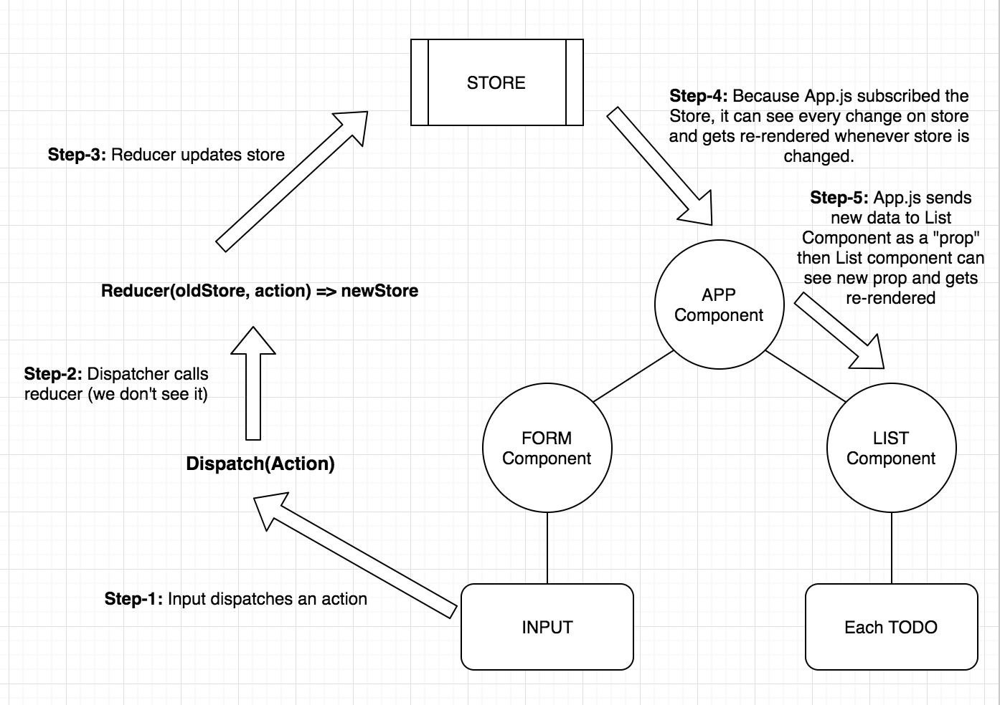

Lets overview the architecture of the React + Redux before the final exam:

1) **Store** is just a JavaScript Object which holds all the data about every component. 
That's why it is called "Single Source of Truth". 

        Store = {
          todoItems: ["make hmw1", "work hard"],
          currentInput: "i am now writing new todo"
        }
        

2) **Reducer** is a function which takes two arguments: "old store" and “current action”. Then updates "old store" 
according to "current action” and then returns "new store”.

        reducer(oldStore, currentAction) { // takes two arguments
          switch(action.type)
           case: “ADD_TODO”:
           const newStore = oldStore + action.data  // 
        
           Return newStore;  // returns newStore which is updated version of the oldStore.
        }

3) **Action** is an object which says reducer what to do.

        action = {
          type: “ADD_TODO”, 
          data: “get ready for the exam”  // which is a new todo-item
        }

4) **Dispatcher** is a function which triggers reducer with an action:  (when you call dispatch function it calls reducer
 with an action)

        dispatch(action);  // Calls reducer with our action.
        

#### Input Component wants to update List Component:

